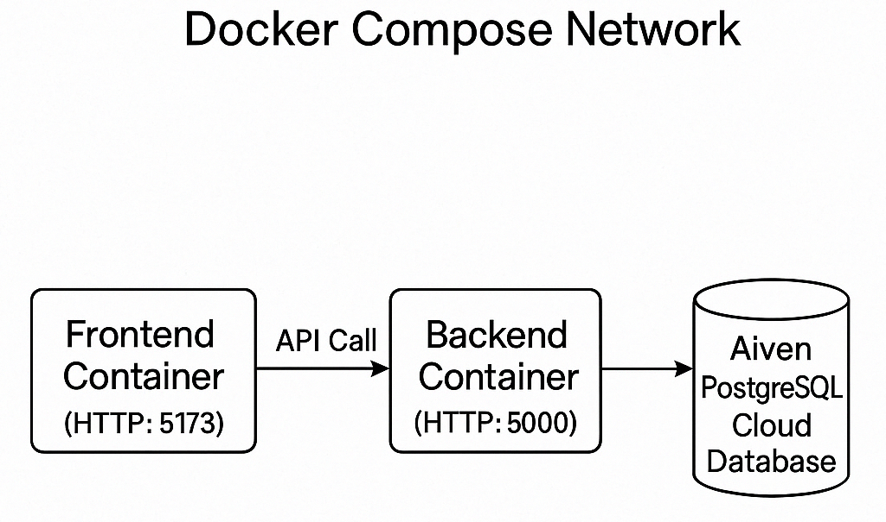
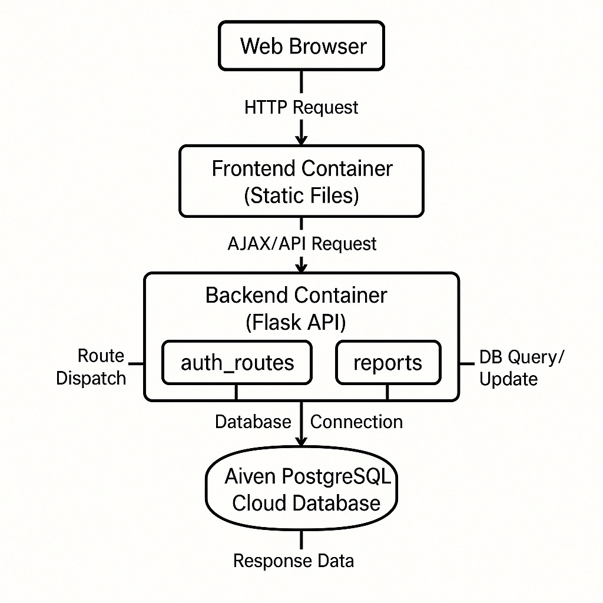
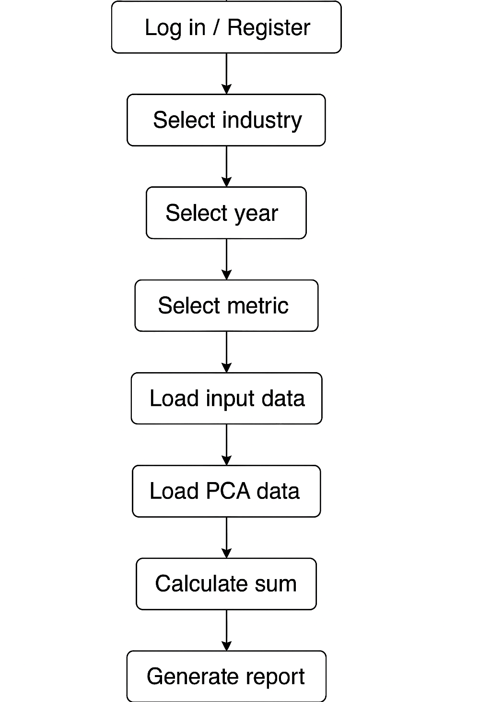

# Docker Implementation Documentation

> This document outlines the technical design, deployment, and testing procedures for the project based on a multi-container architecture. It covers the integrated frontend, backend, and database components employed in this project.

---

If your sole goal is to run the project, simply clone the repository locally. Then open Docker Desktop, open a command prompt, adjust your path as needed, and execute the command in Section 6.2.

---

## Chapter 1: Project Overview and Environment Setup

### 1.1 Project Introduction
This project adopts a decoupled (frontend-backend separated) architecture and utilizes Docker's multi-container deployment to seamlessly integrate the following:
- **Frontend**: A web application built with Vite using modern frontend technologies.
- **Backend**: A RESTful API server constructed with Flask that handles business logic and data communication.
- **Database**: PostgreSQL is used for storing and managing all business data.

### 1.2 Runtime Environment
- **Programming Languages & Tools**
  - Python 3.8 and above  
  - Node.js (for building the frontend)  
  - Docker & Docker Compose

- **System Requirements**
  - Docker Desktop (which includes Docker Compose)
  - A development IDE such as VSCode, PyCharm, etc.

- **Key Dependencies**
  - Frontend: Vite  
  - Backend: Flask, flask_cors, pdfkit  
  - Database: PostgreSQL

- **Downloading the Data Source**  
  Because the `db/data.csv` file is quite large, it has not been uploaded to GitHub. Please download it manually:
  1. Click the following link to download the file:  
     [Download data.csv here](https://drive.google.com/file/d/1uNuLGNQcubkd04YMCil5tSa81iPDDlkQ/view?usp=sharing)
  2. Once downloaded, save the file to the `db/` folder at the project root so that its path is `db/data.csv`.

---

## Chapter 2: Project Structure and Architecture Design

### 2.1 Project Directory Structure
```
docker_implement/
├── frontend/              # Frontend code and container configurations
│   ├── src/              
│   ├── Dockerfile         # Docker build file for the frontend
│   └── vite.config.js    
├── backend/               # Backend code and container configurations
│   ├── app/              
│   │   ├── __init__.py         # Create Flask instance and register blueprints
│   │   ├── db_utils.py         # Database connection utilities
│   │   └── routes/             # Business module routes (including auth_routes.py, reports.py, stardog_routes.py)
│   ├── Dockerfile         # Docker build file for the backend
│   ├── requirements.txt  
│   └── run.py             # Flask application entry point (ensure host="0.0.0.0")
├── db/                   # Files related to the database
│   ├── init.sql          # Database table creation and data import script (mounted to /docker-entrypoint-initdb.d/ in the container)
│   └── data.csv          # Data source file (to be manually downloaded)
└── docker-compose.yml    # Docker Compose multi-container orchestration configuration
```

### 2.2 Architectural Diagrams

#### 2.2.1 Docker Container Relationship Diagram
<p align="center">
  
</p>

*Note*: All containers communicate over the same Docker network. The backend interacts with the frontend via API calls and connects to the database. The `data.csv` file is mounted and imported into the PostgreSQL container.

#### 2.2.2 Frontend-Backend Interaction Flowchart
<p align="center">
  
</p>

*Note*: This diagram shows how requests flow from the client to the frontend container, pass through the backend (where routes and database utilities handle business logic and data exchange), and then return results to update the frontend.

#### 2.2.3 User Operation Flowchart
<p align="center">
  
</p>

*Note*: This chart details the user process from logging in/registering to selecting industry, year, metrics in different categories, choosing a model, loading both raw and PCA-processed data, applying filters for evaluation, and finally generating an ESG report.

---

## Chapter 3: Frontend Implementation

### 3.1 Containerizing the Frontend
- The frontend application is built with Vite and leverages modern web technologies.
- **Example configuration in vite.config.js**:
  ```js
  import { defineConfig } from 'vite';

  export default defineConfig({
    server: {
      host: '0.0.0.0', // Allows external access
      port: 5173
    }
  });
  ```
- **Dockerfile** (located in the `frontend/` directory):
  ```dockerfile
  FROM node:16-alpine
  WORKDIR /app
  COPY package*.json ./
  RUN npm install
  COPY . .
  EXPOSE 5173
  CMD ["npm", "run", "dev"]
  ```

### 3.2 Frontend Deployment and Testing
- To test the frontend independently:
  ```bash
  cd docker_implement/frontend
  docker build -t frontend .
  docker run -p 5173:5173 --name test-frontend frontend
  ```
- Verify by accessing:
  - [http://localhost:5173/](http://localhost:5173/) (accessible externally)
  - Confirm that the frontend page loads correctly in your browser.

---

## Chapter 4: Backend Implementation

### 4.1 Containerizing the Backend
- The backend uses Flask to provide API services; it includes route management and database interaction utilities.
- **Example Dockerfile** (located in the `backend/` directory):
  ```dockerfile
  FROM python:3.8-slim

  # Install system dependencies
  RUN apt-get update && apt-get install -y wkhtmltopdf

  WORKDIR /app

  COPY requirements.txt .
  RUN pip install --upgrade pip && pip install -r requirements.txt

  COPY . .

  EXPOSE 5000

  CMD ["python", "run.py"]
  ```
- Ensure that **requirements.txt** includes dependencies like Flask, flask_cors, and pdfkit.

### 4.2 Backend Deployment and Testing
- Deploy with Docker Compose by running:
  ```bash
  docker-compose up --build
  ```
- To verify the backend API, try accessing a test endpoint (for example):
  - [http://localhost:5000/stardog/getAllCategories?industry=Semiconductors](http://localhost:5000/stardog/getAllCategories?industry=Semiconductors)
  - A valid JSON response indicates the backend is functioning properly.

---

## Chapter 5: Database Implementation

### 5.1 Database Deployment and Configuration
- PostgreSQL is used for data storage. The database initialization script is provided in **db/init.sql**, while **db/data.csv** contains the raw data.
- **Example of init.sql**:
  ```sql
  -- Create table (example)
  CREATE TABLE public.combined (
      id SERIAL PRIMARY KEY,
      data VARCHAR(255)
  );

  -- Import data
  COPY public.combined
  FROM '/data.csv'
  DELIMITER ','
  CSV HEADER;
  ```
- The database is configured in **docker-compose.yml** as follows:
  ```yaml
  db:
    image: postgres
    container_name: postgres
    environment:
      POSTGRES_USER: postgres
      POSTGRES_PASSWORD: postgres
    volumes:
      - ./db/init.sql:/docker-entrypoint-initdb.d/init.sql
      - ./db/data.csv:/data.csv
    ports:
      - "5432:5432"
  ```

### 5.2 Database Testing
- To verify data, connect to PostgreSQL:
  ```bash
  docker exec -it postgres psql -U postgres -d postgres
  ```
- In the psql shell, run:
  ```sql
  SELECT COUNT(*) FROM public.combined;
  SELECT * FROM public.combined LIMIT 5;
  \dt
  ```

---

## Chapter 6: Integrated Deployment (Docker Compose)

### 6.1 Docker Compose Configuration File
Below is an example **docker-compose.yml** file that integrates the frontend, backend, and database:
```yaml
version: '3'
services:
  db:
    image: postgres
    container_name: postgres
    environment:
      POSTGRES_USER: postgres
      POSTGRES_PASSWORD: postgres
    volumes:
      - ./db/init.sql:/docker-entrypoint-initdb.d/init.sql
      # Uncomment the following line if you need to import data.csv
      #- ./db/data.csv:/data.csv
    ports:
      - "5432:5432"

  backend:
    build: ./backend
    container_name: backend
    depends_on:
      - db
    ports:
      - "5000:5000"
    environment:
      DB_HOST: postgres
      DB_PORT: 5432
      DB_NAME: postgres
      DB_USER: postgres
      DB_PASSWORD: postgres

  frontend:
    build: ./frontend
    container_name: frontend
    depends_on:
      - backend
    ports:
      - "5173:5173"
```

### 6.2 Integrated Deployment Steps
1. In the project’s root directory (where **docker-compose.yml** is located), run:
   ```bash
   docker-compose up --build
   ```
2. Validate that each service is operational:
   - Frontend: [http://localhost:5173/](http://localhost:5173/)
   - Backend API: [http://localhost:5000/](http://localhost:5000/)
   - Database: Accessible via port 5432 (e.g., using a psql client).

---

## Chapter 7: Testing and Verification

### 7.1 Individual Component Testing
- Start each container (frontend, backend, database) separately to ensure that each part is functioning correctly.

### 7.2 Integrated Testing
- When running the entire setup via Docker Compose, visit the frontend to verify that API calls are working properly, inspect backend logs for errors, and confirm that data queries return the expected results.

### 7.3 test
- The backend test layout is as follows

```text
backend/test/
├── unit/                    # Unit tests for independent modules/functions
│   ├── test_auth.py
│   ├── test_stardog.py
│   └── test_report.py
├── integration/             # Integration tests for module interactions
│   ├── test_auth_db.py
│   ├── test_stardog_db.py
│   └── test_report_db.py
└── system/                  # System tests for HTTP API endpoints
    ├── test_auth_api.py
    ├── test_stardog_api.py
    └── test_report_api.py
```

- Run command:
```
cd backend
pip install -r requirements.txt
```

- All tests
```
pytest
```

- With coverage
```
pytest --cov=app --cov-report=term-missing
```

- Backend test coverage
Currently, the backend test coverage rate reaches 86%, and the coverage rates of major modules are as follows:
```
* app/__init__.py: 100%
* app/db_utils.py: 100%
* app/routes/auth_routes.py: 96%
* app/routes/report.py: 85%
* app/routes/stardog_routes.py: 83%
```

### The front-end test layout is as follows
```
frontend/cypress/
├── component/ # component
│ ├── FilterBar.cy.jsx
│ ├── GenerateReportButton.cy.jsx
│ ├── MetricCard.cy.jsx
│ ├── MetricDescription.cy.jsx
│ ├── MetricsGrid.cy.jsx
│ └── Sidebar.cy.jsx
└── e2e/ # e2e
├── Dashboard.cy.js
├── HistoryPage.cy.js
├── Login.cy.js
├── Register.cy.js
├── ReportPage.cy.js
└── app.cy.js
```

#### Run command:
```
cd .. # to capstone-project-2025-t1-25t1-9900-f14a-brioche-New-Docker-Demo
cd frontend

pip install -r requirements.txt
npm install cypress
```

#### Start the development server (tests depend on a running server)
```
docker-compose up --build
```

#### All tests
```
npx cypress run --e2e #Run end to end test
npx cypress run --component #Run component test
```

#### Backend test coverage
```
End to end: 100%
Components: 100%
```

### 7.3 Common Troubleshooting
- For any API connectivity issues between the frontend and backend, check:
  - That API endpoints in the frontend are correctly configured (using environment variables is recommended).
  - The backend logs for any errors related to database connectivity or missing dependencies.
  - That database initialization paths and files are correctly mounted.

---

## Chapter 8: Project Modification Guidelines

- **Frontend Adjustments**: The Vite configuration has been optimized for external access within the container. The frontend is built and packaged separately using its Dockerfile.
- **Backend Adjustments**: The API is built with Flask, with routes organized under `app/routes`, and communication with PostgreSQL handled via `db_utils`. The backend has been fully containerized.
- **Database Adjustments**: The `init.sql` script is used to create tables and import data, which also supports resetting the database.

---

## Appendix

### Appendix 1: Environment Variable Mapping

| Component     | Environment Variable | Target               | Example Value |
|---------------|----------------------|----------------------|---------------|
| Backend       | DB_HOST              | PostgreSQL Service   | postgres      |
|               | DB_PORT              |                      | 5432          |
|               | DB_NAME              |                      | postgres      |
|               | DB_USER              |                      | postgres      |
|               | DB_PASSWORD          |                      | postgres      |
| PostgreSQL    | POSTGRES_USER        | Database User        | postgres      |
|               | POSTGRES_PASSWORD    | Database Password    | postgres      |

### Appendix 2: Reference Architectural Diagrams
For further details, please refer back to the Docker container relationship diagram, the frontend-backend interaction flowchart, and the user operation flowchart provided in Chapter 2.
