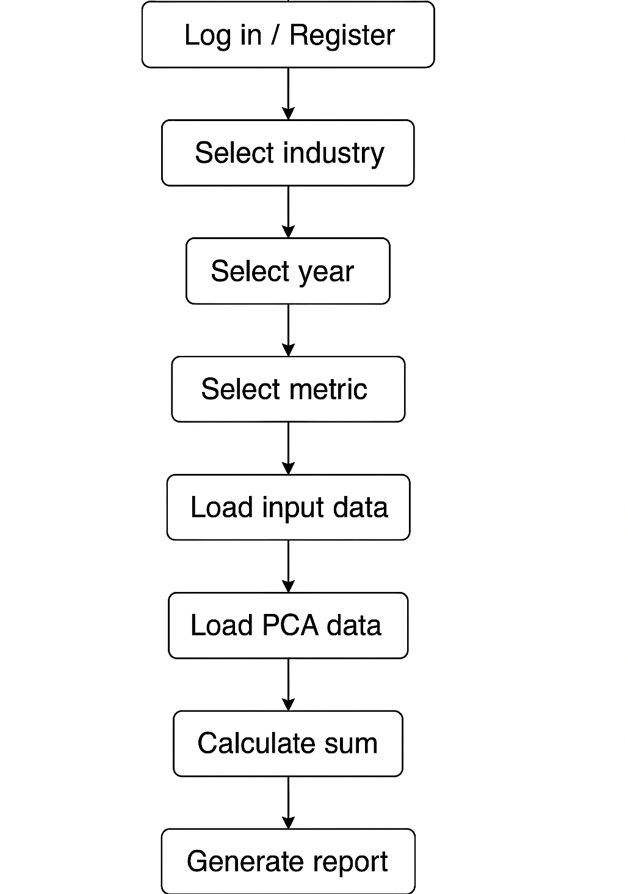

# Docker实现文档

> 本文档基于多容器架构实现项目的技术设计、部署及测试说明，包含本项目实际用到的前端、后端与云数据库集成部分。

---
如果只需要把项目跑起来，直接把代码拉到本地，然后到打开docker desktop，开cmd调整好路径运行6.2的指令即可.
---

## 第一章 项目概述与环境准备

### 1.1 项目简介
本项目采用前后端分离模式，通过 Docker 多容器部署实现前端、后端与数据库的无缝集成，主要包括：
- **前端**：基于 Vite 构建的前端应用（使用现代 Web 前端技术）。
- **后端**：基于 Flask 的 RESTful API 服务器，提供业务逻辑处理与数据接口。
- **数据库**：数据库现在默认使用 **Aiven PostgreSQL** 云端服务，而不再在本地容器中运行 PostgreSQL。

### 1.2 运行环境
- **开发语言与工具**  
  - Python 3.8 及以上  
  - Node.js（用于前端构建）  
  - Docker & Docker Compose

- **系统要求**  
  - 安装 Docker Desktop（含 Docker Compose）  
  - 开发 IDE（如 VSCode、PyCharm 等）

- **关键依赖**  
  - 前端：vite  
  - 后端：Flask、flask_cors、pdfkit  
  - ~~数据库：PostgreSQL~~取消数据库容器组件，直接通过云数据库连接

- **数据源下载（可选）**  
  > **注意**：项目已默认使用云端数据库，无需本地导入 data.csv。  
  > 如果你仍想在本地容器中部署 PostgreSQL 并导入数据，请：
    >  1. 点击以下链接下载文件：  [点击此处下载 data.csv](https://drive.google.com/file/d/1uNuLGNQcubkd04YMCil5tSa81iPDDlkQ/view?usp=sharing)  
    >  2. 下载完成后，请将文件保存到项目根目录下的 `db/` 文件夹中，确保文件路径为 `db/data.csv`。

---

## 第二章 项目结构与架构设计

### 2.1 项目目录结构
```
docker_implement/
├── frontend/              # 前端代码及容器配置
│   ├── src/              
│   ├── Dockerfile        # 前端 Docker 构建文件
│   └── vite.config.js    
├── backend/               # 后端代码及容器配置
│   ├── app/              
│   │   ├── __init__.py        # 创建 Flask 实例并注册蓝图
│   │   ├── db_utils.py        # 数据库连接工具
│   │   └── routes/            # 各业务模块路由（包含 auth_routes.py、reports.py、stardog_routes.py）
│   ├── Dockerfile        # 后端 Docker 构建文件
│   ├── requirements.txt  
│   └── run.py             # Flask 应用入口（注意使用 host="0.0.0.0"）
├── Aiven PostgreSQL        # 直接访问云数据库获取数据
└── docker-compose.yml    # Docker Compose 多容器编排配置文件
```

### 2.2 架构图
#### 2.2.1 Docker 整体架构图
<p align="center">
  
</p>

#### 2.2.2 Docker 容器关系图
<p align="center">
  
</p>

*说明*：各容器在同一 Docker 网络下交互；后端通过 API 与前端通信，并连接云端数据库；~~数据文件 data.csv 通过挂载方式导入 PostgreSQL 数据库~~。

#### 2.2.3 前后端交互流程图
<p align="center">
  
</p>
*说明*：该图展示了请求从客户端经前端容器进入后端，各模块（路由与数据库连接工具）完成业务逻辑与数据交互，然后返回结果给前端更新页面。

#### 2.2.4 用户侧操作流程图
<p align="center">
  
</p>

*说明*：此流程图描述了用户从登录/注册，逐步选择行业、年份、各类别下的指标、选择模型，再加载原始数据和 PCA 处理后的数据、筛选评估部分，最终计算并生成 ESG 报告的流程。

---

## 第三章 前端实现

### 3.1 前端容器化配置
- 前端项目基于 Vite 构建，采用现代前端技术栈。
- **vite.config.js** 配置示例：
  ```js
  import { defineConfig } from 'vite';

  export default defineConfig({
    server: {
      host: '0.0.0.0', // Allow external access
      port: 5173
    }
  });
  ```
- **Dockerfile**（位于 frontend/ 目录）：
  ```dockerfile
  FROM node:16-alpine
  WORKDIR /app
  COPY package*.json ./
  RUN npm install
  COPY . .
  EXPOSE 5173
  CMD ["npm", "run", "dev"]
  ```

### 3.2 前端部署与测试
- 单独测试前端：
  ```bash
  cd docker_implement/frontend
  docker build -t frontend .
  docker run -p 5173:5173 --name test-frontend frontend
  ```
- 验证地址：
  - [http://localhost:5173/](http://localhost:5173/)（外部访问）
  - 浏览器中检查前端页面是否正确加载

---

## 第四章 后端实现

### 4.1 后端容器化配置
- 后端使用 Flask 构建 API，主要模块包括业务路由与数据库操作工具。
- **Dockerfile**（位于 backend/ 目录）示例：
  ```dockerfile
  FROM python:3.8-slim

  # 安装系统依赖
  RUN apt-get update && apt-get install -y wkhtmltopdf

  WORKDIR /app

  COPY requirements.txt .
  RUN pip install --upgrade pip && pip install -r requirements.txt

  COPY . .

  EXPOSE 5001

  CMD ["python", "run.py"]
  ```
- **requirements.txt** 中需包含 Flask、flask_cors、pdfkit等依赖。

### 4.2 后端部署与测试
- 使用 Docker Compose 集成部署：
  ```bash
  docker-compose up --build
  ```
- 验证后端接口（示例测试接口）：
  - [http://localhost:5001/stardog/getAllCategories?industry=Semiconductors](http://localhost:5000/stardog/getAllCategories?industry=Semiconductors)
  - 若返回 JSON 数据，则说明后端正常运行

---

## 第五章 数据库实现

### 5.1 数据库架构

- 使用 Aiven PostgreSQL，数据库中存储 5 个核心数据表：

  | 表名              | 功能描述                                                                 |
  | ----------------- | ------------------------------------------------------------------------ |
  | **category**      | 存储行业或类别信息，如 “Semiconductors”、“Finance” 等，用于下拉选项。     |
  | **combined**      | 合并后的原始数据集入口，承载 `db/data.csv` 导入的所有数据记录。           |
  | **metric_weights**| 各指标权重配置，定义不同 ESG 指标在计算时的权重分布，用于前端计算结果。    |
  | **report_history**| 用户生成报告的历史记录，包括报告参数、生成时间、输出文件路径等。          |
  | **users**         | 系统用户信息，如用户名、邮箱、角色权限等，用于鉴权与日志审计。             |
  
- 云数据库访问（在 docker-compose.yml 中定义）：
  ```yaml
  backend:
    # ...其他不相关配置
    environment:
      # 配置数据库连接需要的环境变量
      DB_HOST: pg-esgdatabse-project-esgdatabase.j.aivencloud.com
      DB_PORT: "18275"
      DB_NAME: defaultdb
      DB_USER: avnadmin
      DB_PASSWORD: "AVNS_F5e6LKp-jfqdleDTmz5"
      DB_SSLMODE: require
  ```

---

## 第六章 集成部署（Docker Compose）

### 6.1 Docker Compose 配置文件
整合前端、后端与数据库的完整 **docker-compose.yml** 示例：
```yaml
version: '3'
services:

  backend:
    build: ./backend
    container_name: backend
    # depends_on:
    #   - db
    ports:
      - "5001:5001"
    environment:
      # 配置数据库连接需要的环境变量
      DB_HOST: pg-esgdatabse-project-esgdatabase.j.aivencloud.com
      DB_PORT: "18275"
      DB_NAME: defaultdb
      DB_USER: avnadmin
      DB_PASSWORD: "AVNS_F5e6LKp-jfqdleDTmz5"
      DB_SSLMODE: require

  frontend:
    build: ./frontend
    container_name: frontend
    depends_on:
      - backend
    ports:
      - "5173:5173"
```

### 6.2 集成部署步骤
1. 在项目根目录（包含 docker-compose.yml）下运行：
   ```bash
   docker-compose up --build
   ```
2. 验证各组件：
   - 前端：[http://localhost:5173/](http://localhost:5173/)
   - 后端 API：[http://localhost:5001/](http://localhost:5001/)
   - 数据库：通过 5432 端口连接（调试使用，例如 psql 工具）

---

## 第七章 测试与验证

### 7.1 单独测试
- 分别启动前端、后端、云数据库容器验证各自功能是否正常。


### 7.2 集成测试
- 在 Docker Compose 环境下，访问前端页面验证 API 调用是否正常，后端日志是否无错误信息，数据库数据查询是否正确。


## 7.3 test
## 后端测试排版如下

backend/test/
├── unit/             # 单元测试：测试独立模块或函数
│   ├── test_auth.py             # 用户认证相关功能测试
│   ├── test_report.py           # 报告生成功能测试
│   └── test_stardog.py          # Stardog 查询与数据处理测试
├── integration/      # 集成测试：测试模块间交互
│   ├── test_auth_db.py          # 认证模块与数据库交互测试
│   ├── test_report_db.py        # 报告模块与数据库交互测试
│   └── test_stardog_db.py       # Stardog 与 PostgreSQL 交互测试
└── system/           # 系统测试：测试 HTTP API 端点
    ├── test_auth_api.py         # 认证 API 接口测试
    ├── test_report_api.py       # 报告 API 接口测试
    └── test_stardog_api.py      # Stardog 相关 API 测试


## 运行命令：
cd backend
pip install -r requirements.txt

# 所有测试
pytest

# 带覆盖率
pytest --cov=app --cov-report=term-missing

# 后端测试覆盖率
当前后端测试覆盖率达到86%，主要模块覆盖率如下：
* app/__init__.py: 100%
* app/db_utils.py: 100%
* app/routes/auth_routes.py: 96%
* app/routes/report.py: 85%
* app/routes/stardog_routes.py: 83%


### 前端测试排版如下
frontend/cypress/
├── component/         # component
│   ├── FilterBar.cy.jsx
│   ├── GenerateReportButton.cy.jsx
│   ├── MetricCard.cy.jsx
│   ├── MetricDescription.cy.jsx
│   ├── MetricsGrid.cy.jsx
│   └── Sidebar.cy.jsx
└── e2e/               # e2e
    ├── Dashboard.cy.js
    ├── HistoryPage.cy.js
    ├── Login.cy.js
    ├── Register.cy.js
    ├── ReportPage.cy.js
    └── app.cy.js

## 运行命令：
cd ..   # to capstone-project-2025-t1-25t1-9900-f14a-brioche-New-Docker-Demo 
cd frontend 

pip install -r requirements.txt
npm install cypress


## 启动开发服务器（测试依赖于运行中的服务器）
docker-compose up --build

# 所有测试
npx cypress run --e2e    #运行end to end 测试
npx cypress run --component   #运行component 测试


# 后端测试覆盖率
End to end : 100%
Components : 100%

## 第八章 前后端实现逻辑

### 8.1 前端
- 详见frontend文件夹内部的[frontendReadme](frontendReadme.md)
### 8.2 后端
- 详见backend文件夹内部的[backendReadme](backend/backendReadme.md)

## 第九章 更新日志

### 1.1.0（2025‑04‑23）
- **端口调整**  
  - 前端容器和后端容器监听端口由 `5000` 调整为 `5001`  
- **依赖变更**  
  - 后端新增 `python-dotenv` 库  
  - 在 `requirements.txt` 中补充缺失依赖  
- **Docker 配置**  
  1. 在 `backend/run.py` 中将 `host` 设置为 `"0.0.0.0"`，以暴露 API  
  2. 在 `frontend/vite.config.js` 中添加 `host: "0.0.0.0"`，以允许外部访问  


